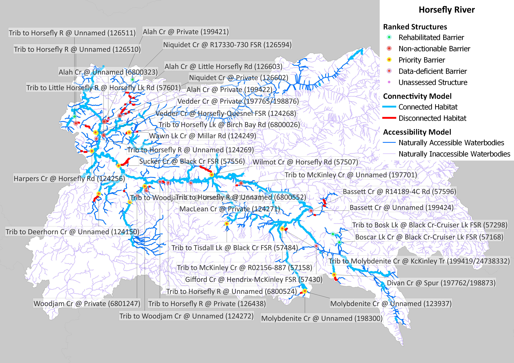

---
jupyter: python3
---

## Executive Summary {-}

```{python}
#| echo: false
#| output: false
from content.python.api_calls_v2 import get_metric_value, get_structure_count_value

connected_km = get_metric_value("HORS", "accessible_spawningrearing_all")
disconnected_km = get_metric_value("HORS", "disconnected_spawningrearing_all")
total_km = get_metric_value("HORS", "total_spawningrearing_all")
connected_pct = round((connected_km / total_km) * 100, 1)

potentially_disconnect_structures = get_structure_count_value(
    "hors", "all_spawningrearing", "structures_that_potentially_disconnect_habitat"
)
priority_barriers = get_structure_count_value(
    "hors", "all_spawningrearing", "priority_barriers"
)
non_actionable_barriers = get_structure_count_value(
    "hors", "all_spawningrearing", "non_actionable_barriers"
)
further_field_assessment = get_structure_count_value(
    "hors", "all_spawningrearing", "require_further_assessment"
)
```

The purpose of the Horsefly River (Secwepemcúl’ecw) Watershed Connectivity Restoration Plan (WCRP) is to improve connectivity for anadromous salmon and the livelihoods that they support, including the continued sustenance, cultural, and ceremonial needs of the Northern Secwépemc people and build collaborative partnerships within the Horsefly River watershed to achieve this goal. This plan aims to improve understanding of habitat connectivity for Sockeye Salmon (Oncorhynchus nerka), Chinook Salmon (O. tschawytcha), and Coho Salmon (O. kisutch); herein referred to as Pacific salmon, in the Horsefly River watershed (Secwepemcúl’ecw) and inform efforts to close knowledge gaps and plan and prioritize restoration. Local data and knowledge are combined with connectivity modelling to estimate current connectivity status and identify structures that potentially block the most habitat. This informs the prioritization of field assessments to close the most significant knowledge gaps efficiently. Information from field assessments of barrier status and habitat condition are incorporated into the model, improving understanding of which barriers block the most habitat, and informing restoration prioritization. As knowledge gaps are closed and barriers are addressed, this plan will be revised to summarize progress and provide updated estimates of connectivity status and the status and relative importance of remaining structures. 

In the Horsefly River watershed, `{python} connected_km` km of Pacific salmon spawning and rearing habitat are currently connected to the ocean and `{python} disconnected_km` km are disconnected from it. This means that `{python} connected_pct`% of the `{python} total_km` km of total habitat is connected. 

In the Horsefly River watershed, `{python} potentially_disconnect_structures` structures potentially disconnect Pacific salmon spawning or rearing habitat. Of these, `{python} priority_barriers` are identified as barriers in need of rehabilitation (priority barriers), `{python} non_actionable_barriers` are identified as barriers that do not warrant rehabilitation (non-actionable), and `{python} further_field_assessment` require further field assessment. 

::: {#fig-map}


Map of Pacific salmon spawning and rearing habitat and structures that are confirmed or potential barriers to fish passage in the Horsefly River watershed as of May 2026. Structure data were obtained from BCFishPass and the Canadian Aquatic Barriers Database (aquaticbarriers.ca). The accessibility model represents areas of the watershed that one or more species of Pacific salmon could access naturally in the absence of anthropogenic barriers. The habitat model represents the subset of accessible waterbodies that may be used by one or more species of Pacific salmon for spawning or rearing. Available local knowledge and data were incorporated and overruled habitat model results. Thick red lines represent habitat considered to be fully disconnected (upstream of barriers or unassessed structures). Barriers that were rehabilitated through implementation of this plan are shown, but other excluded structures (e.g., those found to be passable) are not.
:::

::: {#fig-hac}


Habitat Accumulation Curve (HAC) showing structures in the Horsefly River watershed as of May 2026. Structures are ranked based on how much (km) habitat for spawning or rearing is upstream. The y-axis represents the cumulative amount of potential habitat gain (km). Sets of structures are indicated by a grey line below the curve, indicating that gains from addressing the downstream structure alone would be less than the combined gains from addressing all structures in the set. Habitat upstream of unassessed structures is considered disconnected until field assessments are completed. Structures that were excluded as passable are not shown; however, rehabilitated barriers are shown to demonstrate the connectivity gains achieved through implementation of this plan.
:::

This WCRP was initiated in 2020. Since then, the passability of 100 structures has been assessed, and further habitat assessments were completed at 29 of these. Fish passage has been rehabilitated at 4 barriers: a culvert was removed and road deactivated on Boscar Lake Creek, and culverts on Niquidet Creek, an unnamed tributary to Bosk Lake, and an unnamed tributary to Horsefly River were replaced with clearspan bridges. This has resulted in improved or restored access to 4 km of spawning and rearing habitat. Lateral (side channel and off-channel) connectivity and thermal refugia were also assessed in a portion of the mainstem Horsefly River in 2022 by the Horsefly River Roundtable, Northern Shuswap Tribal Council and Williams Lake First Nation, and fish passage at 14 trail-stream crossings was also completed by the Williams Lake First Nation in 2022. 
